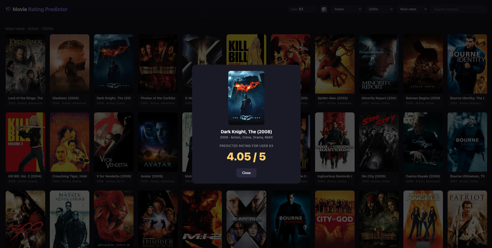

# 🎬 Movie Rating Predictor

A machine learning project that predicts how a specific user will rate a movie — built on the MovieLens dataset, with a personalized genre-affinity model and a browsable, poster-driven web app.

**Live demo:** [https://movie-rating-predictor-lgej.onrender.com](https://movie-rating-predictor-lgej.onrender.com)



## What It Does

| Component | Description |
|-----------|-------------|
| Preprocessing | Engineers 27 features from ~100,000 real user ratings, including a personalized user-genre affinity signal |
| Model | Random Forest Regressor predicting a specific user's rating for a specific movie |
| API | FastAPI backend serving live predictions and movie data |
| Frontend | Poster grid with genre/decade/sort filters, live search, and TMDB poster art |
| Exploration | Jupyter notebook with data analysis and visualizations |

## Tech Stack
- **ML** — Python 3, scikit-learn, Pandas, NumPy
- **API** — FastAPI, Uvicorn
- **Data** — [MovieLens ml-latest-small](https://grouplens.org/datasets/movielens/latest/) (GroupLens) + [TMDB API](https://www.themoviedb.org/documentation/api) for posters/metadata
- **Deployment** — Render
- **Dev Tools** — Git, GitHub, Jupyter, pip, python-dotenv

## Model Performance

| Metric | Value |
|--------|-------|
| RMSE | **0.7499** (predictions average ~0.75 stars off, on a 0.5–5 scale) |
| R² Score | 0.4888 |

The single biggest driver of accuracy was **user-genre affinity** — a personalization feature computed per user (how much *this specific person* tends to like the genres a given movie has), rather than relying only on a movie's overall popularity. It ranks as the #2 most important feature in the trained model, just behind overall movie quality.

**Top feature importances:**
```
avg_rating              0.4396
user_genre_affinity     0.3840   <- personalization signal
user_avg_rating         0.0426
user_num_ratings        0.0259
num_ratings              0.0235
```

## Feature Engineering

Beyond raw `user_id` / `movie_id`, the model uses:
- **Genre flags** — one-hot encoded per movie (Action, Comedy, Drama, etc.)
- **Release year**
- **Movie popularity** — `num_ratings`, `avg_rating`
- **User rating behavior** — `user_num_ratings`, `user_avg_rating` (this dataset has no demographic data, so user rating tendency stands in for it)
- **User-genre affinity** — for each user, their personal average rating across every genre they've rated; at prediction time, averaged across the specific genres of the movie in question. This is what actually personalizes a prediction instead of just reflecting the movie's general popularity.

## Project Structure
```
movie-rating-predictor/
├── app.py                    # FastAPI app: predictions, search, browse, poster serving
├── requirements.txt
├── data/
│   ├── raw/ml-latest-small/  # MovieLens dataset (movies, ratings, links)
│   └── processed/            # Engineered features, lookup tables, poster cache
├── notebooks/
│   └── exploration.ipynb     # EDA and visualizations
├── src/
│   ├── preprocess.py         # Feature engineering (genres, year, user-genre affinity)
│   ├── train.py               # Model training and evaluation
│   ├── predict.py             # Loads model, builds feature rows, generates predictions
│   ├── tmdb_client.py          # Poster/overview lookup via TMDB, with local caching
│   └── warm_poster_cache.py    # Pre-fetches posters for popular movies before deploy
└── model/
    └── movie_rating_model.pkl  # Trained model (generated)
```

## Run Locally
```bash
# 1. Clone the repo
git clone https://github.com/Shrihan245/movie-rating-predictor.git
cd movie-rating-predictor

# 2. Create and activate a virtual environment
python3 -m venv venv
source venv/bin/activate

# 3. Install dependencies
pip install -r requirements.txt

# 4. Download the MovieLens ml-latest-small dataset into data/raw/
# https://files.grouplens.org/datasets/movielens/ml-latest-small.zip

# 5. Get a free TMDB API key (themoviedb.org/settings/api) and add it to a .env file:
echo "TMDB_API_KEY=your_key_here" > .env

# 6. Preprocess, train, and warm the poster cache
python3 src/preprocess.py
python3 src/train.py
python3 -m src.warm_poster_cache

# 7. Start the API
uvicorn app:app --reload
```

## What I Learned
- Building a full ML pipeline from raw data → engineered features → trained model → deployed API
- Designing a genuinely personalized feature (user-genre affinity) instead of relying on movie-level stats alone
- Serving ML predictions through a REST API and pairing it with a real frontend, not just a form
- Integrating a third-party API (TMDB) with proper caching, environment-variable secrets, and graceful degradation when data is missing
- Debugging real production issues: environment variable loading, git handling of large binary files (GitHub's 100MB limit), and stale-cache bugs from bad data
- Managing a git history cleanly — recovering from oversized commits, keeping secrets out of version control

## Roadmap
- Let visitors rate a few movies live and get real personalized predictions (not just a numeric User ID)
- "Recommended for you" ranking across all unrated movies for a given user
- Show *why* a rating was predicted (surface genre affinity in the UI)
- Compare Random Forest against other models (Gradient Boosting, matrix factorization)

## Author
Shrihan Bodapati — Built as a portfolio project to explore machine learning, feature engineering, and full-stack deployment.

[GitHub](https://github.com/Shrihan245) · [LinkedIn](https://www.linkedin.com/in/shrihan-bodapati)